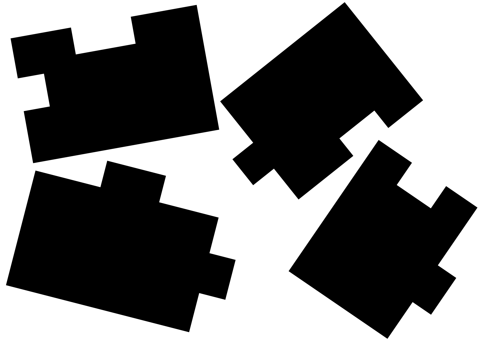

# Solutions Made by Hand

## Simple Rotation

File: simple_1_rotated.png

### Index:

- Piece 1 - Bottom Left
- Piece 2 - Bottom Right
- Piece 3 - Top Left
- Piece 4 - Top Right

### Solution:

| Idx\* | 1           | 2              | 3             | 4             |
| ----- | ----------- | -------------- | ------------- | ------------- |
| 1     | -           | (Right/Top)    | (Top/Top)     |               |
| 2     | (Top/Right) | -              |               | (Right/Right) |
| 3     | (Top/Top)   |                | -             | (Left/Bottom) |
| 4     |             | (Right/Bottom) | (Bottom/Left) | -             |

> **_Explanation:_**\
> \* : **( x / y )** <=> ...\
> &nbsp;&nbsp;&nbsp;&nbsp;&nbsp;&nbsp; **x** := side of piece with Idx = _#row_ \
> &nbsp;&nbsp;&nbsp;&nbsp;&nbsp;&nbsp; **y** := side of piece with Idx = _#column_
